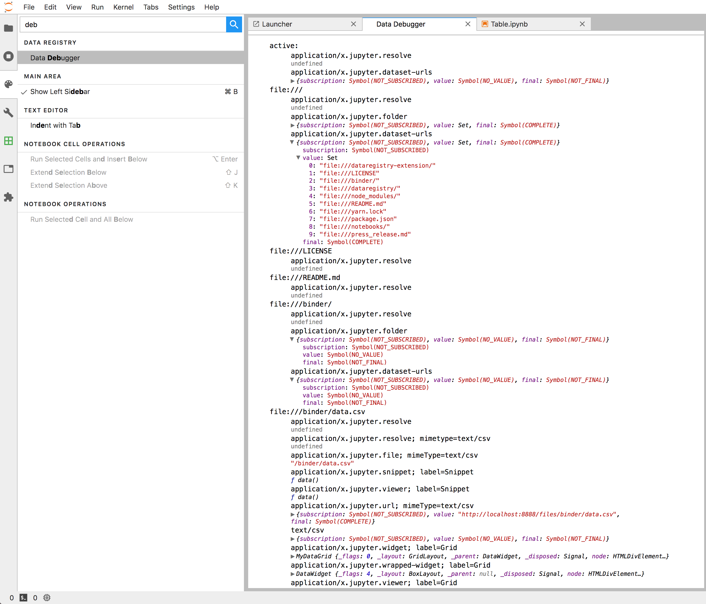

# JupyterLab Data Explorer

 [](https://mybinder.org/v2/gh/jupyterlab/jupyterlab-data-explorer/a4ae231f6e1c52b5aee1dd7fad4985722d863456?urlpath=lab/tree/notebooks/Table.ipynb) [](https://www.npmjs.com/package/@jupyterlab/dataregistry-extension) [](https://www.npmjs.com/package/@jupyterlab/dataregistry)

```bash
jupyter labextension install @jupyterlab/dataregistry-extension
```

* Bring any data type you can imagine! **Extensible** and **type safe** data registry system.
* Register **conversions** between the different data types.
* Data changing on you? Use [`RxJS` **observables**](https://rxjs.dev/) to represent data over time.
* Have a new way to look at your data? Create **React** or **Phosphor** components to view a certain type.
* Built in data **explorer UI** to find and use available datasets.
* Dataset in your dataset? Use the **nested** datatype.
* Building another data centric application? Use the **`@jupyterlab/dataregistry`** package which has no JupyterLab dependencies.
* Check out the project vision in the ["Press Release from the Future"](./press_release.md)!


## Core concepts

The data registry is a global collection of datasets. Each dataset is conceptually a tuple of `(URL, MimeType, cost, data)`; however, we store them in nested maps of `Map<URL, Map<MimeType, [cost, data]>>` so that, for every unique pair of URL and MimeType, we only have one dataset ([`./dataregistry/src/datasets.ts`](./dataregistry/src/datasets.ts)).

A "converter" takes in a dataset and returns several other datasets that all have the same URL. We can apply a converter to a certain URL by viewing it as a graph exploration problem. There is one node per Mime Type and we can [fill in the graph](https://en.wikipedia.org/wiki/Dijkstra's_algorithm) to add every reachable mime type with the lowest cost ([`./dataregistry/src/converters.ts`](./dataregistry/src/converters.ts)). 

Conceptually, each Mime Type should correspond to some defined runtime type of data. For example `text/csv` corresponds to an `Observable<string>` which is the contents of CSV file. We need to be able to agree about these definitions so that, if create a converter to produce a `text/csv` mime type and you create one that takes in that mime type and creates some visualization, we know we are dealing with the same type. A "data type" helps us here because we map a set of mime types to a TypeScript type. For example, we could define the CSV mime type as `new DataTypeNoArgs<Observable<string>>("text/csv")`. We provide a way to create a converter from one data type to another, which is `createConverter`. Data types abstract away the textual representation of the mime type from the consumer of a data type and provide a type safe way to convert to or from that data type. All of our core conversions use this typed API ([`./dataregistry/src/datatypes.ts`](./dataregistry/src/datatypes.ts)):

* [`resolveDataType`](./dataregistry/src/resolvers.ts) `void`: Every URL starts with this data type when you ask for it. It has no actual data in it, so when you write a converter from it you will use the URL.
* [`nestedDataType`](./dataregistry/src/nested.ts) `Observable<Set<URL_>>`: This specifies the URLs that are "nested" under a URL. Use this if your dataset has some sense of children like a folder has a number of files in it or a database has a number of tables. These are exposed in the data explorer as the children in the hierarchy.
* [`viewerDataType`](./dataregistry-extension/src/viewers.ts) `() => void`: This is a function you can call to "view" that dataset in some way. It has a parameter as well, the "label", which is included in the mime type as an argument. This is exposed in the explorer as a button on the dataset.

<!-- 
So conceptually, we can see a number of datasets as a number of graphs, one for each URL. Adding a new converter can expand the possible Mime Types for each URL. In the registry we can either register a new converter, get all the mime types for an existing URL, or retrieve the list of current URLs that are registered ([`./dataregistry/src/registry.ts`])(./dataregistry/src/registry.ts)). 

When we first ask for a URL, we have to create some initial mime type to describe that URL. We
made up the `application/x.jupyter.resolve` mime type for this. All datasets start with the mime type, so to derive some other mime type you have to start from this one ([`./dataregistry/src/resolve.ts`])(./dataregistry/src/resolve.ts)). -->

## I want to...

### Explore my data in JupyterLab:

1. Install JupyterLab >= 1.0
2. `jupyter labextension install @jupyterlab/dataregistry-extension`
3. Browse available datasets in the data explorer left side pane. We include support for viewing a few datasets. We plan on expanding this list and third party extension can extend it:
   1. Opening CSV files in the data grid and adding a snippet to open them with Pandas
   2. Opening PNG images in an image viewer
   3. Opening table data outputted in a notebook with [`nteract`'s data explorer](https://github.com/nteract/nteract/tree/master/packages/data-explorer)


### Support a new data type or conversion:

You can either add support in this repo or by creating a new JupyterLab extension that depends on the `IRegistry` exposed by this extension. You can access a `Registry`, which you can use to add your own converter. 

It might also be useful to view the existing data types by looking at the source code in this repo and by using the debugger. You can open this in JupyterLab by looking for the "Data Debugger" command:



### Develop on this repo:

```bash
git clone https://github.com/jupyterlab/jupyterlab-data-explorer.git
cd jupyterlab-data-explorer

// (optional) Create a fresh conda environment
// conda create -n jupyterlab-data-explorer -c conda-forge python=3.6
// conda activate jupyterlab-data-explorer

// Install Jupyterlab
pip install jupyterlab

// Build and link the data explorer packages
jlpm build:dev

// Run Jupyterlab
jupyter lab
```

## Contributing

This repo is in active development, and we welcome any collaboration. If you have ideas or questions, feel free to open an issue. From there, we could setup a call to chat more in depth about how to work together. Please don't hesitate to reach out.

Or, feel free to tackle an existing issue or contribute a PR that you think improves things. We try to keep the current issues relevant and matched to relevant milestones to give a sense on where this is going.

If the community grows around this, we can adopt a more regular public meeting.
