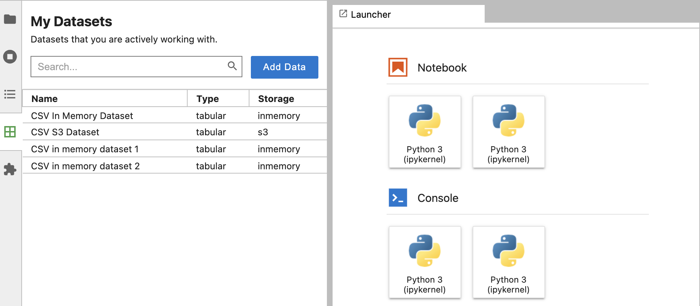
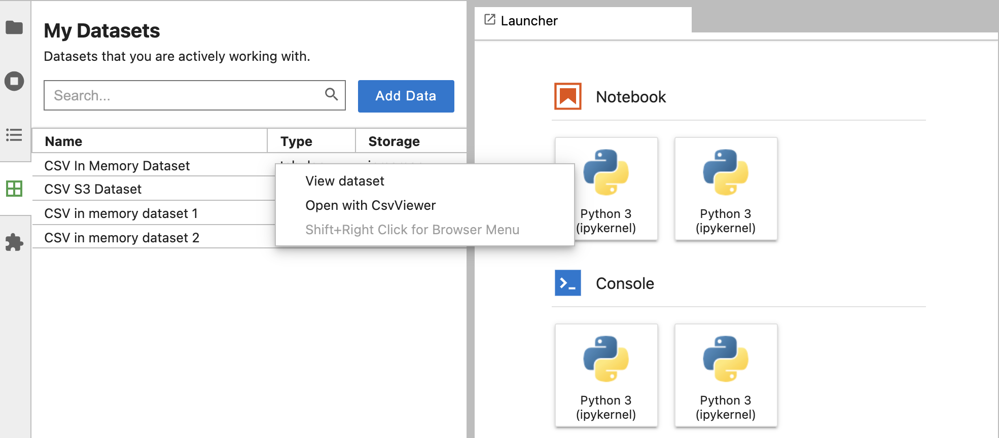
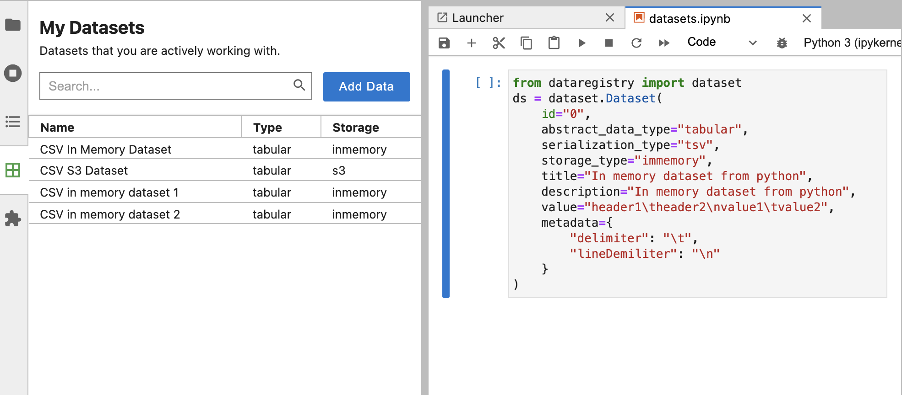

# Data Registry - "My Data" for JupyterLab

JupyterLab is a platform where users explore data to extract insights and make decisions. They can visualize and model datasets from a variety of sources such as files, databases, and APIs. Accessing data in JupyterLab requires navigating a complex web of places data could live, e.g., certain datasets may only become accessible by running a particular notebook that assesses the data from another location on hard drive or a remote server. While JupyterLab has always been a fantastic tool to interface with data, there is no shared definition of what a dataset actually is. JupyterLab relies on its extension ecosystem to provide various features, and data is central to these plugins. Since, extension developers have no common knowledge of a dataset, each of them come up with their own version of what a dataset means, and how it acts. This effort is duplicated across extensions which also hinders portability of data between extensions.

The Jupyter Data Registry aims to help data scientists work more effectively by treating data as a first class entity. The new dataset entity will provide a simple but flexible interface to represent datasets in a consistent, but configurable way. The data registry API will enable lab users to see the datasets they are actively working with and allow them to load, visualize and manage these datasets within notebooks and other extensions in JupyterLab. The data registry will also enable organizations to publish datasets for their end users in a consistent fashion through files, databases or plugins.

Data Registry provides 3 main components:

1. A typed JSON based dataset interface to represent any kind of dataset
2. A data registry API to register, retrieve and manage datasets
3. A command registry API to allow extension authors to register user actions with specific dataset types

Data Registry provides both a TypeScript and a Python API to register new datasets. The TypeScript interface allows data providers to register new datasets via plugins; this also allows extension writers to create commands and associate these commands with a specific dataset type. The Python API provides an additional way to register datasets inside notebooks; this also enables registering dataset definition stored in files with “dataset” extension. Dataset providers can share dataset files or notebooks containing dataset definitions with JupyterLab users.

### Dataset Interface

A typed JSON based extensible interface that can be used to represent any kind of dataset. Dataset interface expects 2 types, one for defining the value and second for the metadata. Having these as typed values allows creating any kind of dataset. In addition, the attributes abstract data type, storage type and serialization type are declared as string types which allows flexibility for data providers to define datasets that can span a vast range of mime types, with extensibility to support any future mime types.

```ts
export interface Dataset<T extends JSONValue, U extends JSONValue> {
    /**
     * Unique identifier for the dataset, for in-memory
     * datasets, a unique uuid might be provided.
     * This id should be unique across a jupyter server instance.
     */
    id: string;
    /**
     * Abstract data type for the dataset, e.g.,
     * tabular, image, text, tabular collection
     */
    abstractDataType: string;
    /**
     * Serialization type for the dataset e.g.,
     * csv, jpg
     */
    serializationType: string;
    /**
     * Storage type for the dataset e.g.,
     * inmemory, file, s3
     */
    storageType: string;
    /**
     * Output value for the dataset
     */
    value: T;
    /**
     * Additional properties for the dataset
     * that help serialize or query data
     */
    metadata: U;
    title: string;
    description: string;
    tags?: Set<string>;
    version?: string;
}
```

#### Id

A string that represents the unique identifier for the dataset, is expected to be unique across a JupyterLab instance.

#### Abstract Data Type

A string that captures the abstract data type for the dataset, and is largely defined by the dataset provider. This property represents a very high level abstraction of the data type which might not conform to a specific mime type but rather provide a more general view of the dataset. Most datasets with features might fall under “tabular” because they will have a set of labels/columns with multiple rows of values. Some other examples are “image” to represent any single image, “image-collection” to represent a set of images, and “text” to represent free-form or structured text data.

#### Serialization Type

A string that captures information about the serialization format of the data. This property represents the specific subtype which can be used to serialize or visualize the data. For example, tabular datasets can be represented in “csv” or “tsv”, images might be “jpeg”, “png” etc. Some other examples are “text”, “json”, “svg”, “sql”.

#### Storage Type

A string that defines how the data is stored, e.g., S3, database, in memory etc.

#### Value

Nullable value which defines the type for the actual value of the dataset, e.g., for an in memory comma separated file, this might represent the actual string value of the data.

#### Metadata

Defines the type for capturing any metadata associated with the dataset that might help extension writers or JupyterLab users download/serialize the data. e.g., for a tabular dataset, this might capture the delimiter and line delimiter; for a dataset stored in S3, this might capture the credentials or folder and object information.

#### Title

A string that is used largely for display purposes to identify the dataset.

#### Description

A string that captures some more detail about the dataset, so extension developers and users have more context of what kind of data is stored in the dataset.

#### Tags

List of arbitrary strings that could be attached to the dataset which might aid searching and identification of similar datasets.

#### Version

A string that defines the version of the dataset.

Here are a few examples of real world datasets expressed using the dataset interface.

#### In memory dataset in CSV format

```js
{
    id: '47e0c8a6-b49f-46ec-88e7-bbb7be2cbb52',
    abstractDataType: 'tabular',
    serializationType: 'csv',
    storageType: 'inmemory',
    value: 'lovingly photographed in the manner of a golden book sprung to life stuart little 2 manages sweetness largely without stickiness,pos\nconsistently clever and suspenseful,pos\nred dragon never cuts corners,pos',
    metadata: {
      delimiter: ',',
      lineDelimiter: '\n',
    },
    title: 'Rotten Tomatoes Dataset',
    description: 'Movie Review Dataset. This is a dataset containing positive and negative processed sentences from Rotten Tomatoes movie reviews',
    version: '1.0',
}
```

#### Directory of images stored in S3

```js
{
    id: 's3://covid19-dataset',
    abstractDataType: 'image-collection',
    serializationType: 'png',
    storageType: 's3',
    value: null,
    metadata: {
    bucket: 'covid19-dataset',
        folders: {
            'train': ['train/Covid', 'train/Normal', 'train/Viral Phenomena'],
            'test': ['test/Covid', 'test/Normal', 'test/Viral Phenomena']
        }
    },
    title: 'Covid-19 Image Dataset',
    description: 'This dataset will help deep learning and AI enthusiasts to contribute to improving COVID-19 detection using Chest X-rays. Data was collected from publicly released GitHub account by the University of Montreal professors. The Pneumonia data has been taken from the RSNA website.',
    version: '2.1',
}
```

#### Dataset stored in a SQL database

```js
{
    id: 'f6712a3c-c902-412b-9a0f-e5e581e21739',
    abstractDataType: 'tabular',
    serializationType: 'mysql',
    storageType: 'database',
    value: null,
    metadata: {
        database: {
            host: 'localhost',
            port: '3306',
            name: 'jobs-data'
        },
        table: 'usa-ds-jobs'
    },
    title: 'Data Scientist Job Market in the U.S.',
    description: 'This dataset provides job data for open data scientist jobs in U.S. posted on Indeed.com. The information collected includes company name, position, location, description, and number of reviews. The questions that this dataset helps answer are 1) What skills, tools, majors are most sought 2) Which location has most opportunities 3) Whats the difference between data scientist, data engineer and data analyst?',
    version: '1.0',
}
```

**Note**: The above example specifies a “dataset” vs a “datasource”. However, the dataset interface could be easily applied to datasources as well. For example, for a dataset definition to represent a collection of tables might be represented by an abstractDataType of “sql-tabular” with relevant details to connect/serialize in the metadata property.

### Data Registry API

Data registry aims to catalog datasets in a JupyterLab environment, and provides APIs to register, update and retrieve datasets. These are the core set of APIs which will be shared with other extensions to help them manage datasets. Data registry provides these APIs:

```ts
export interface IDataRegistry {
    /**
     * Registers a dataset. Use {*@link *Registry#updateDataset}
     * to update a registered dataset.
     *
     * *@param *dataset The dataset to register
     * *@throws *Throws an error if dataset with
     * same id and version already exists.
     */
    registerDataset<T extends JSONValue, U extends JSONValue>(
        dataset: Dataset<T, U>
    ): void;

    /**
     * Updates a registered dataset, bumps up the version.
     *
     * *@param *dataset The dataset to update
     * *@throws *Throws an exception if any of abstractDataType,
     * serializationType or storageType are different from
     * registered values.
     */
    updateDataset<T extends JSONValue, U extends JSONValue>(
        dataset: Dataset<T, U>
    ): void;

    /**
     * Returns last registered version of dataset if no version is passed.
     *
     * *@param *id unique id dataset was registered with
     * *@param *version optional, specific dataset version
     * *@throws  *Will throw an error if no matching dataset found
     */
    getDataset<T extends JSONValue, U extends JSONValue>(
        id: string,
        version?: string
    ): Dataset<T, U>;

    /**
     * Returns dataset signal for subscribing to changes in dataset
     * See {*@link *https://jupyterlab.github.io/lumino/signaling/classes/signal.html|Signal}
     * to learn more about use of signals to subscribe to changes in dataset.
     *
     * *@param *id unique id used to register the dataset
     * *@returns *{*@link *https://jupyterlab.github.io/lumino/signaling/classes/signal.html|Signal} signal instance associated with dataset
     * *@throws *{Error} Will throw an error if
     */
    getDatasetSignal<T extends JSONValue, U extends JSONValue>(
        id: string
    ): Signal<any, Dataset<T, U>>;

    /**
     * Returns true if dataset exists, false otherwise
     *
     * *@param *id unique id that was used to register the dataset
     * *@param *version version that dataset was registered with
     * *@returns *{boolean} true if matching dataset exists
     */
    hasDataset<T extends JSONValue, U extends JSONValue>(
        id: string,
        version?: string
    ): boolean;

    /**
     * Returns list of datasets that match the passed abstract data type,
     * serialization type, and storage type.
     *
     * *@param *abstractDataType abstract data type to match
     * *@param *serializationType serialization type to match
     * *@param *storageType storage type to match
     * *@returns *{Dataset[]|[]} list of matching datasets
     */
    queryDataset(
        abstractDataType?: string,
        serializationType?: string,
        storageType?: string
    ): Dataset<any, any>[] | [];

    /**
     * Registers a command for datasets having a set of abstract data type,
     * serialization type, and storage type. This is useful for extension
     * writers to associate specific dataset types with commands/actions
     * that their extensions support.
     *
     * *@param *commandId unique id of the command registered with the command registry
     * *@param *abstractDataType abstract data type
     * *@param *serializationType serialization type
     * *@param *storageType storage type
     */
    registerCommand(
        commandId: string,
        abstractDataType: string,
        serializationType: string,
        storageType: string
    ): void;

    /**
     * Get list of commands registered with a specific set of
     * abstract data type, serialization type, and storage type.
     * This is useful for extension writers to obtain only those commands
     * that have been previously registered with the dataset type.
     *
     * *@param *abstractDataType abstract data type
     * *@param *serializationType serialization type
     * *@param *storageType storage type
     * *@returns *{Set[string]|[]} set of registered commands
     */
    getCommands(
        abstractDataType: string,
        serializationType: string,
        storageType: string
    ): Set<string> | [];

    /**
     * This signal provides subscription to
     * event when any datasets are registered.
     */
    readonly datasetAdded: Signal<any, Dataset<any, any>>;

    /**
     * This signal provides subscription to
     * event when any updates are made to datasets.
     */
    readonly datasetUpdated: Signal<any, Dataset<any, any>>;

    /**
     * This signal provides subscription to
     * event when any command is registered.
     */
    readonly commandAdded: Signal<any, String>;
}
```

#### Registering new datasets

**Use the Typescript API**

Plugins/extensions can access the data registry object by adding a dependency on the IDataRegistry interface. Plugins can add new datasets by using the “register” API from Data Registry. Here is an example of a plugin that registers a dataset.

```ts
const datasets: JupyterFrontEndPlugin<void> = {
    id: '@jupyterlab/datasets:plugin',
    autoStart: true,
    requires: [IDataRegistry],
    activate: (app: JupyterFrontEnd, registry: IDataRegistry) => {
        interface ICSVMetadata extends JSONObject {
            delimiter: string;
            lineDelimiter: string;
        }

        interface IS3CSVMetadata extends ICSVMetadata {
            bucket: string;
            filename: string;
        }

        registry.registerDataset<JSONValue, IS3CSVMetadata>({
            id: 's3://bucket/filename',
            abstractDataType: 'tabular',
            serializationType: 'csv',
            storageType: 's3',
            value: null,
            metadata: {
                delimiter: ',',
                lineDelimiter: '\n',
                bucket: 'bucket',
                filename: 'filename',
            },
            title: 'CSV S3 Dataset',
            description: 'CSV in S3 dataset',
            version: '1.0',
        });
    },
};
```

##### Use Notebook (Python API)

In addition to the Typescript API, a Python Dataset class is provided to allow lab users to register datasets within the notebook. Creating a new instance of the Dataset class within a notebook cell and executing the cell will invoke the“register” API. Here is an example of using the Python API to register a new dataset.

```py
from dataregistry import dataset

ds = dataset.Dataset(
    id="s3://airport-data",
    abstract_data_type="tabular",
    serialization_type="tsv",
    storage_type="s3",
    title="Most Crowded Airports",
    description="The dataset contains 250 different airports and each airport has the following attributes: rank, name, location, country, code, passengers, year",
    value=None,
    metadata={
        "delimiter": "\t",
        "lineDemiliter": "\n"
    }
)
```

##### Use a dataset file

Another way for users to register datasets would be to create a file with “dataset” extension with definition of dataset in JSON. This feature allows an object with a single dataset definition or an array to register multiple datasets. Opening the file will register all datasets defined inside the file. Here is an example of datasets defined in a dataset file.

```js
[
    {
        id: '100',
        abstractDataType: 'tabular',
        storageType: 'inmemory',
        value: {
            value: 'header1,header2\nvalue1,value2',
        },
        metadata: {
            delimiter: ',',
            lineDelimiter: '\n',
        },
        title: 'CSV in memory dataset 1',
        description: 'CSV in memory dataset 1',
        version: '1.0',
    },
    {
        id: '200',
        abstractDataType: 'tabular',
        storageType: 'inmemory',
        value: {
            value: 'header1,header2\nvalue3,value4',
        },
        metadata: {
            delimiter: ',',
            lineDelimiter: '\n',
        },
        title: 'CSV in memory dataset 2',
        description: 'CSV in memory dataset 2',
        version: '1.0',
    },
];
```

##### Attach actions to datasets (Command Registry API)

Data registry provides APIs to register commands to specific dataset types, and retrieve a set of commands registered to those dataset types. This is useful for populating a variety of action-based widgets that perform an action associated with loading, visualizing or managing specific datasets.

Data providers can register commands with a specific dataset by using the “registerCommand” API.

```ts
registry.registerCommand('render-csv', 'tabular', 'csv', 'inmemory');
```

Extension writers can use the “getCommands” API to get all commands registered for a specific data, serialization, and storage types. They can use these list of commands to bind actions to specific datasets. Specific datasets can be queried by using the “queryDataset” API. Here is an example of an extension that adds a panel in the lab launcher for each dataset registered with a command “render-csv”.

```ts
const commandId = 'render-csv';

const command = registry
    .getCommands('tabular', 'csv', 'inmemory')
    .find((c) => c === commandId);

if (command) {
    const datasets = registry.queryDataset('tabular', 'csv', 'inmemory');

    datasets.forEach((dataset) => {
        app.commands.addCommand(`${dataset.id}`, {
            label: `${dataset.id}`,
            execute: (args) => {
                const { value } = args.dataset;
                alert(value);
            },
        });

        // Adds a new panel in launcher which will
        // present an alert with dataset value
        launcher.add({
            command: `${dataset.id}`,
            category: 'Datasets',
            args: {
                dataset,
            },
        });
    });
}
```

### My Datasets UI

Data registry extension adds a dataset explorer panel to JupyterLab UI that will allow JupyterLab users to view and interact with all registered datasets within a single JupyterLab instance. This extension tracks dataset additions and updates via data registry within a JupyterLab session.



This widget also provides a context menu that allows execution of registered commands/actions associated with a dataset.



“Add Data” button allows users to register a new dataset by auto-populating a dataset creation template in a notebook cell; this can be edited and customized by the user to register a new dataset. This feature uses the python API for registering a new dataset. Executing the notebook cell will register the dataset defined inside the cell.



## Open Questions

### Types for abstract data, Serialization and storage

The properties Abstract Data Type, Serialization Type and Storage Type in the Data Registry API are all “string” types at the moment, so there is no schema that could be enforced on these values. There are several options to control these values. Here are some proposed solutions:

#### Record in documentation

Document and maintain all types in a repository as part of documentation.

_PROS_

-   Easy to maintain, new additions just need documentation update, no code change required.

_CONS_

-   It is easy for API users to misspell values in the code which might end up creating datasets that have diverged from the documentation.
-   Since there is no enforcement, dataset providers might not confirm to documented values which could end up cluttering lab environment with duplicated values.

#### Use Enums

Codify types in the data registry code as typescript enum values so these values are strongly typed.

_PROS_

-   Ensures that API users don’t diverge from the allowed values.
-   Easy for API users to follow, as the API will enforce these values and code completion hints will help see what values are available.

_CONS_

-   Addition of new values need code change and release cycle. This might slow down API users and adds some friction to adoption of the API.

#### Build an API

Provide an API to allow data providers and extension writers to add new type values.

_PROS_

-   Provides flexibility and a programmatic way to add new values.
-   Will avoid duplication of values
-   Can help with normalization of values e.g., “tabular” and “TABULAR” should not be 2 different types.

_CONS_

-   As this provides only programmatic access, it is not easy to see existing values.
-   As there is no human supervision, similar values could still be added. For example, “csv” and “comma-sep” might signify the same serialization types.

### Types (Generics) for value and metadata in Dataset

Dataset interface allows JSON typed values for the “value” and “metadata” properties. This is currently open to any interface/types, which introduces a chance that there might be duplication and redundant types. There is some benefit in standardizing these values for common dataset types. Here are a few approaches to tackle this.

#### Record interfaces in documentation

Add documentation for these interfaces for different dataset types.

_PROS_

-   Easy to maintain, new additions just need documentation update, no code change required.

_CONS_

-   It is easy for API users to misspell values in the code which might end up creating interfaces that have diverged from the documentation.
-   Since there is no enforcement, dataset creators might not confirm to documented values which could end up cluttering lab environment with duplicated values.

#### Define typescript interfaces

Add interfaces, and allow only these interfaces to be used in data registry.

_PROS_

-   Ensures that API users don’t diverge from defined interfaces.
-   Easy for API users to follow, as the API will enforce these values and code completion hints will help see what properties are allowed.

_CONS_

-   Addition of new interface or updates to existing need code change and release cycle. This might slow down API users and adds some friction to adoption of the API.

#### Hybrid approach

Define interfaces for certain dataset types, but also allow others to be documented and added within the registry api.

_PROS_

-   Allows flexibility of adding new dataset types and documenting them for common use.
-   Provides structure and adherence to commonly used dataset types, so that users don’t have to re-invent these interfaces.
-   As new interfaces become mature, these could be moved inside the code to improve adherence to single definition of these interfaces.

_CONS_

-   For 100% adherence, code change required to add new interfaces to registry api.
-   Needs governance around which new interfaces could be moved to the code.
