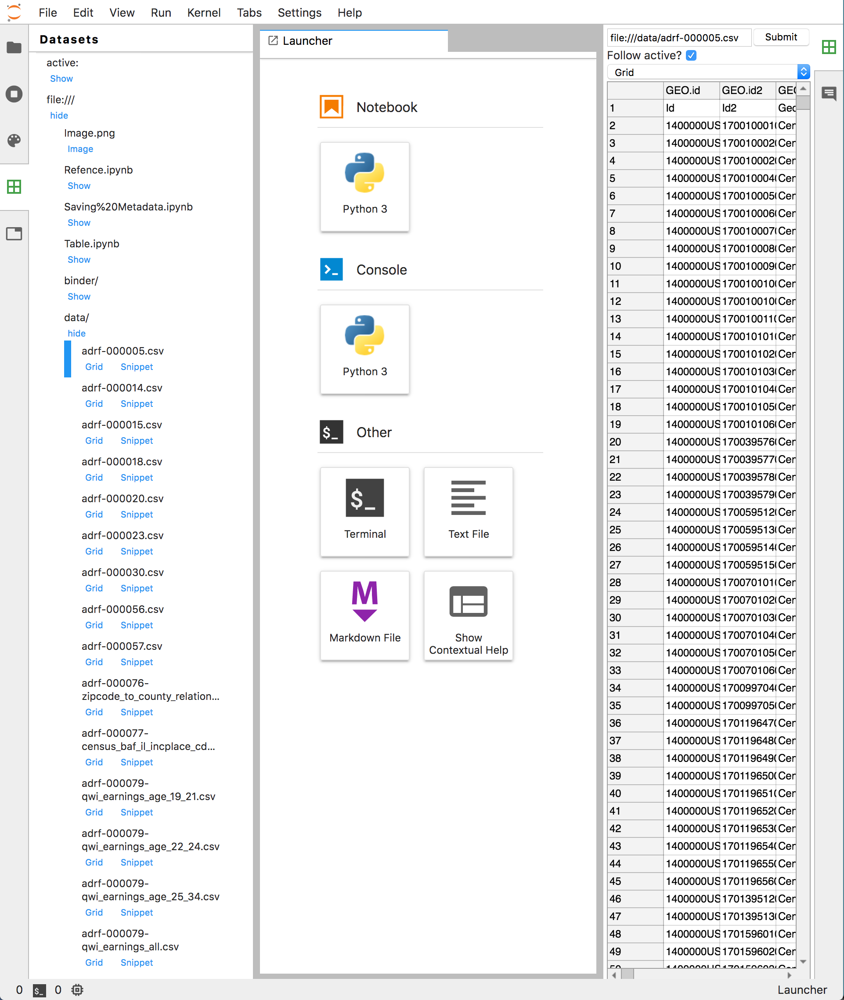
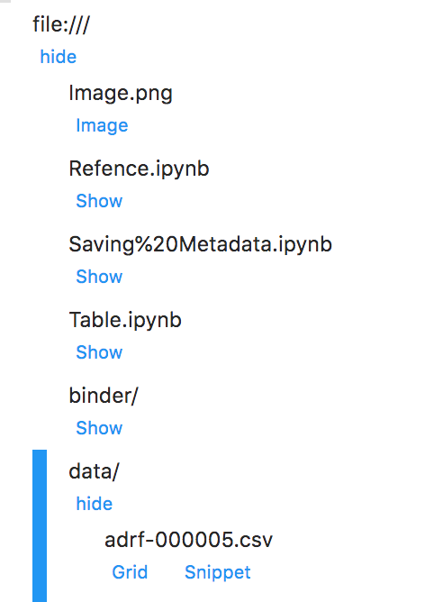
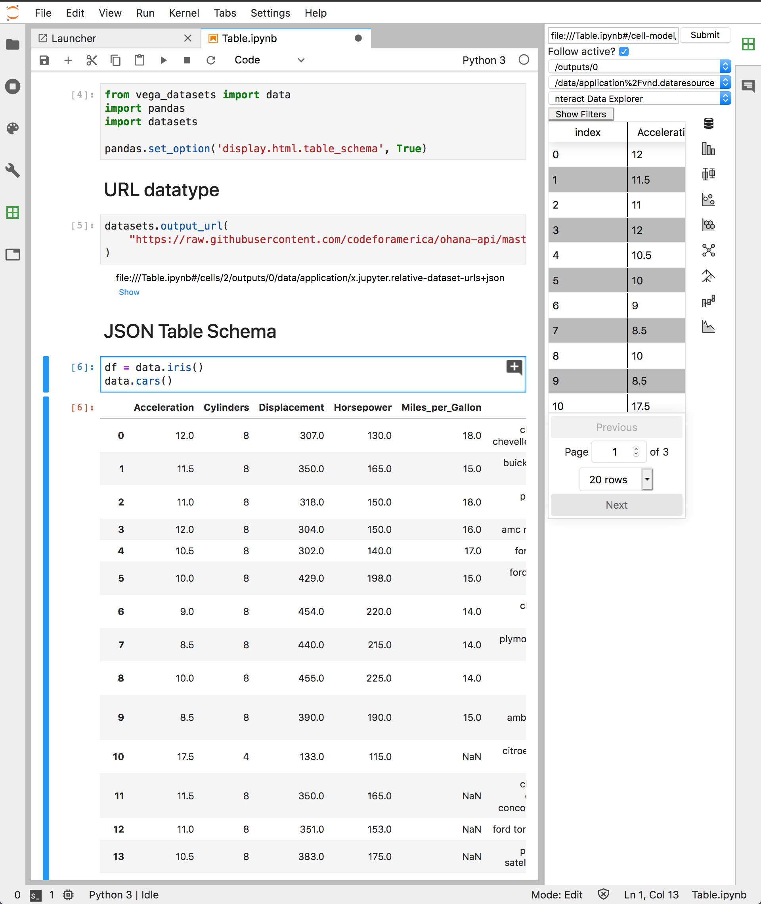

# Usage

The Data Registry JupyterLab extension adds two new UI elements, a Data Explorer in the left pane, and a Data Browser in the right pane:

The Data Registry lets you browse datasets that are available to you. It is a nested view that shows a number of actions you can take for each dataset along with any children datasets.

We currently provide built-in support for a limited number of data types. These are meant to show examples of different types of interactions and stress test the system. They can be extended by creating custom JupyterLab extensions which add new data types and/or viewers:

-   CSV files
    -   Viewing in a data grid
    -   Inserting a code snippet to load with Pandas
-   `datasets.yml` files can be created which allow you to create nested datasets to display, without having to write a JupyterLab extension
    -   Custom snippets for the datasets defined within the file
    -   Custom labels to change how it is displayed in the data registry
-   JSON Table Schema
    -   [`nteract`'s data explorer][nteract-data-explorer]
-   Images
    -   Viewing
-   Folders
    -   Showing contents as children
-   Notebooks
    -   Showing cells and outputs as children
    -   Registering output MIME types

If you are browsing a number of datasets and want to preview the different ways to view them, you can use the Data Browser. It will display any views of the currently "active" dataset. A dataset becomes active if you click on it in the Data Registry, switch to a file widget, or change cells. This is also extensibble, so if you create a custom widget, you can update the active dataset to include selections inside of it. We provide a `demo.ipynb` Notebook which shows a number of different MIME types we support, that you can explore in the Data Browser:

You can also install other extensions to add functionality to the data registry, including:

-   [`@jupyterlab/hdf5`][hdf5] Adds support for viewing HDF5 files

<!-- links -->

[nteract-data-explorer]: https://github.com/nteract/nteract/tree/master/packages/data-explorer
[hdf5]: https://github.com/jupyterlab/jupyterlab-hdf5

<!-- /.links -->
